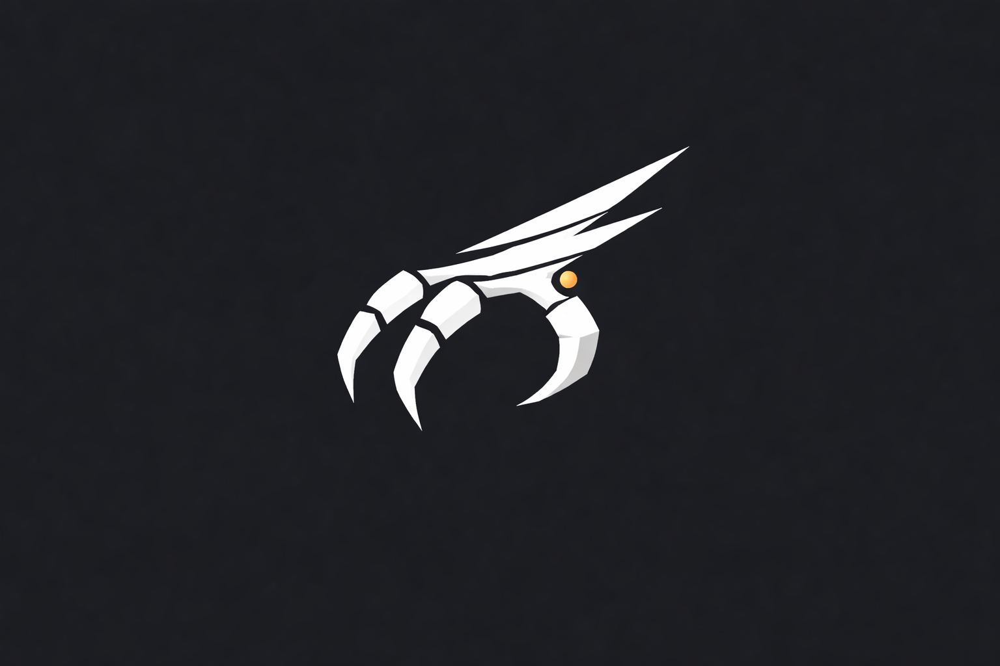

  

# 🦅 TALON

**TALON** is a minimal, Android-first vehicle telemetry app focused on reliable, fuel-centric data collection using a Bluetooth OBD-II adapter.

The project prioritizes **end-to-end correctness on real hardware** over feature breadth. TALON is designed to evolve incrementally, with each phase proving real-world value before expanding scope.

---

## North Star

> **Reliable, fuel-centric vehicle telemetry, end-to-end on real hardware.**

If TALON:
- connects reliably,
- shows accurate live data (especially fuel),
- records trips without dying,

then it is succeeding.

Everything else compounds from there.

---

## Current Status

- **Phase 1:** ✅ Complete  
  Live OBD-II connection, core PIDs, diagnostics (read/clear codes)

- **Phase 2:** ⏳ Planned / In Progress  
  Trip recording (manual), foreground service, file-backed storage, Markdown export

See [`docs/roadmap.md`](docs/roadmap.md) for the full phased plan.

---

## Features (by Phase)

### Phase 1 — Live Telemetry (Complete)
- Bluetooth Classic (SPP / RFCOMM) OBD-II connection
- Manual device selection (paired devices only)
- ELM327 initialization
- Live polling (single in-flight command, conservative rate):
  - Vehicle speed
  - Engine RPM
  - Coolant temperature
  - Fuel level
- Diagnostics:
  - Read DTCs (Mode 03)
  - Clear DTCs with confirmation (Mode 04)
- Explicit failure handling (no silent failure)

### Phase 2 — Trip Recording (Planned)
- Manual trip start/stop
- Foreground service (persistent notification + stop action)
- 1 Hz sampling cadence
- Hybrid GPS + OBD speed logic
- File-backed trip storage:
  - `trip.json` (authoritative summary)
  - `samples.csv` (authoritative samples)
  - `trip.md` (derived export)
- Graceful handling of signal loss and process death

---

## Design Principles

- **Smallest surface first**  
  Features must justify their cost. No speculative abstractions.

- **Explicit tradeoffs**  
  Constraints (e.g. single in-flight OBD command) are deliberate and documented.

- **No silent failure**  
  Connection loss, signal loss, and partial data are surfaced explicitly.

- **Real hardware wins**  
  Decisions are validated against real vehicles, not mocks alone.

- **Phases are contracts**  
  Each phase has exit criteria. We do not blur phase boundaries.

---

## Architecture (Current)

### Android
- Kotlin + Jetpack Compose
- Single-Activity app
- Tab-based navigation (Dashboard / Diagnostics / Trips)
- No ViewModels until required by complexity

### OBD
- Bluetooth Classic only (BLE explicitly out of scope for now)
- ELM327-compatible adapters
- One `obd/` package:
  - Socket connection
  - AT command init
  - PID send/read/parse

### Storage (Phase 2+)
- App-scoped external storage (`getExternalFilesDir`)
- File-based trips in Phase 2
- Structured DB (Room) introduced in Phase 3 via migration

---

## What TALON Is *Not* (Yet)

- No BLE OBD adapters
- No auto-start / auto-stop trips
- No cloud sync or backend
- No charts or analytics dashboards
- No “smart” reconnection logic

Those may come later **only if justified by real use**.

---

## Development & Testing

### Requirements
- Android Studio
- Physical Android device (recommended)
- Bluetooth OBD-II adapter (ELM327-compatible)
- Vehicle with OBD-II port

### Running
1. Pair OBD adapter with phone (system Bluetooth settings)
2. Build & run the app from Android Studio
3. Use the **Connect** button on the Dashboard to select the paired adapter

### Debugging
- Use `adb logcat` for Bluetooth / OBD protocol logs
- All connection and parsing errors are logged in detail

---

## Roadmap

The full roadmap lives in:

- [`docs/roadmap.md`](docs/roadmap.md)

It includes:
- Phase goals and exit criteria
- Explicit policies (transport, polling, failure handling)
- Migration plans between phases
- Long-arc alignment with future power/voltage telemetry

---

## License

TBD.

(Internal project; licensing to be decided when scope stabilizes.)

---

## Project Name

**TALON** — a precision instrument.  
Designed to grip real data, not chase abstractions.
